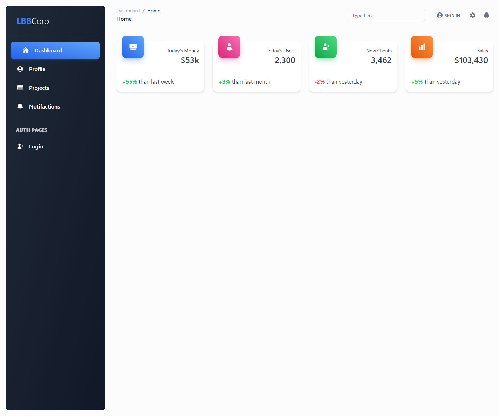
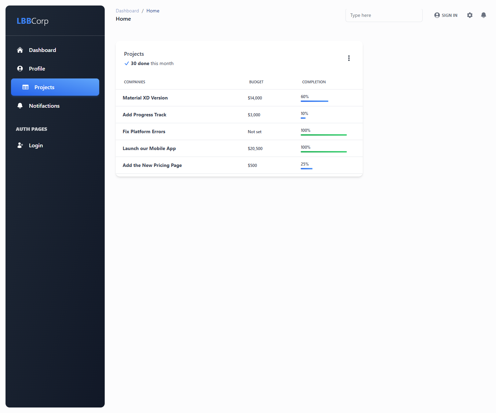
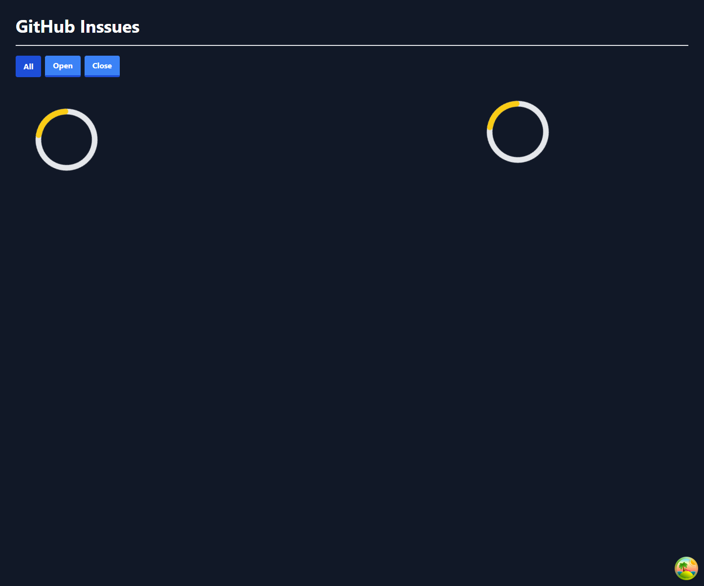
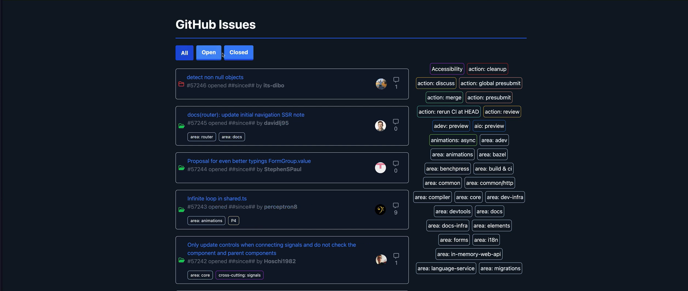
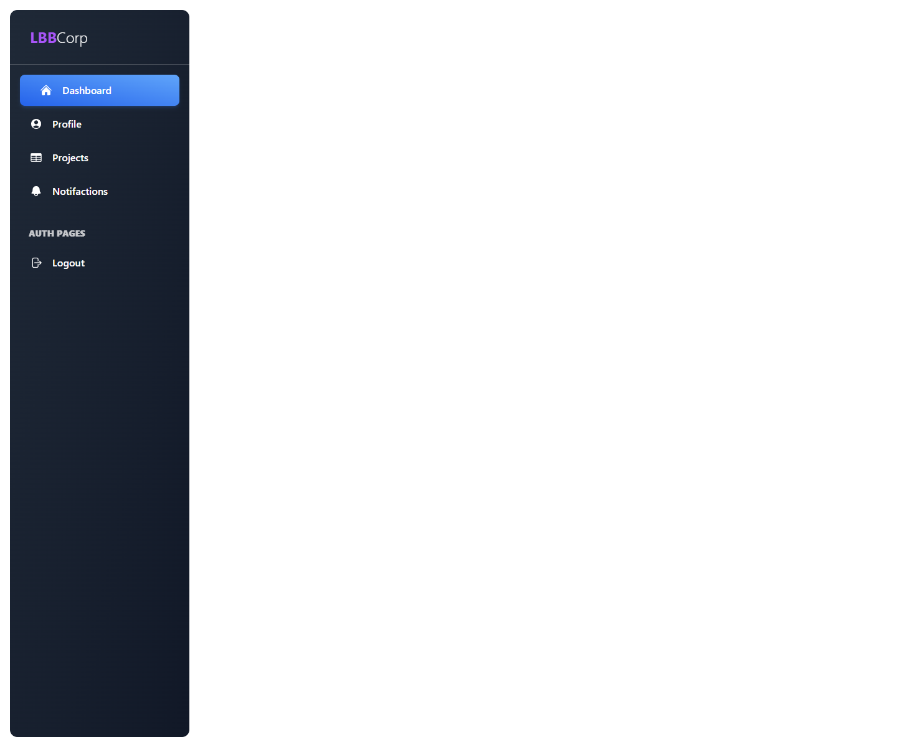
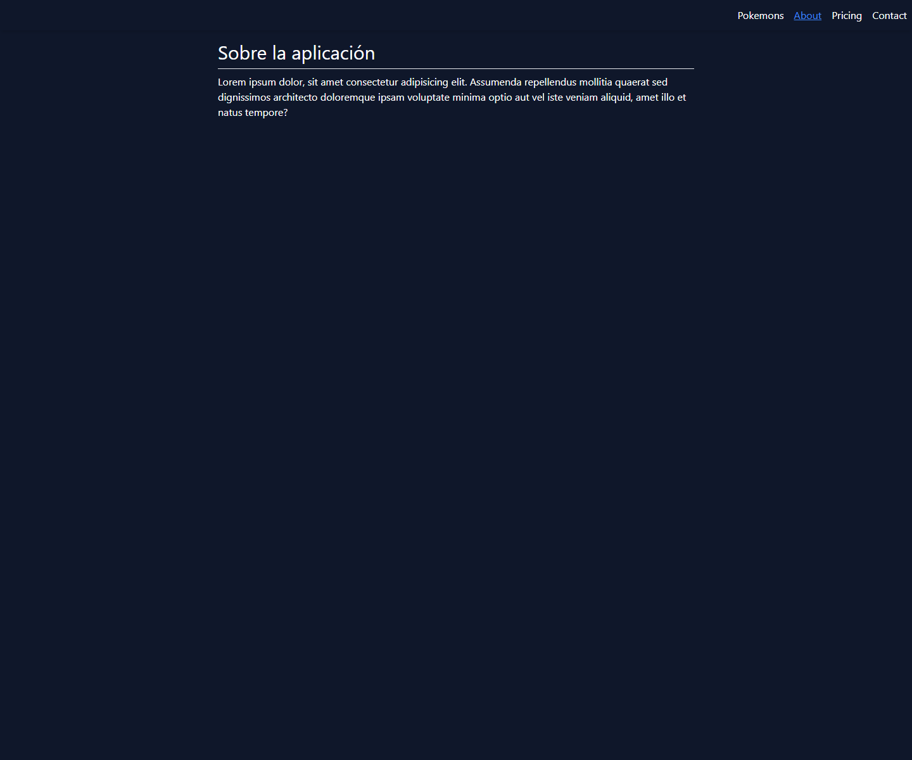
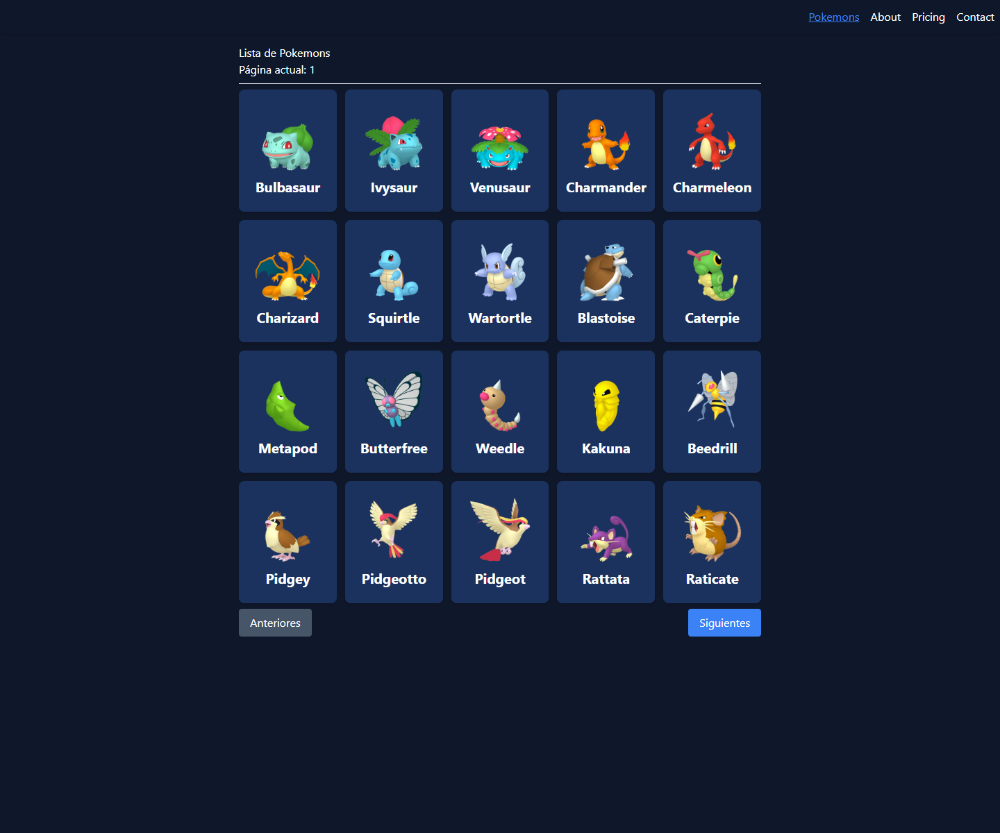
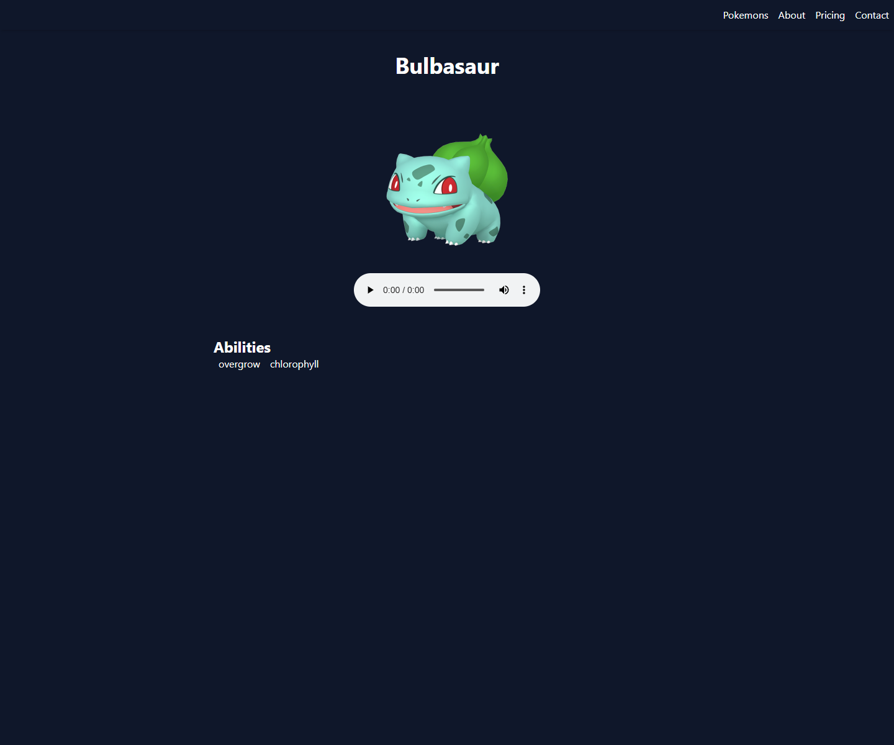
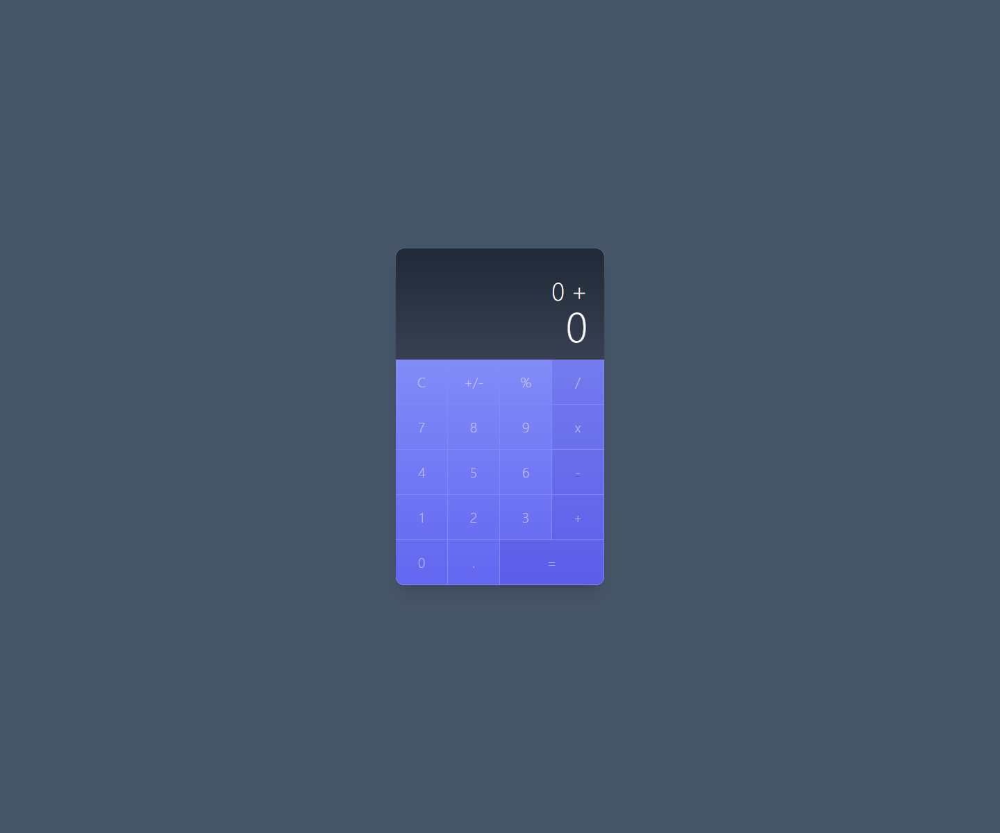

# Curso Angular 2

Repositorio con varios proyectos de práctica desarrollados durante un curso avanzado de Angular. Incluye aplicaciones standalone, consumo de APIs externas, SSR, una calculadora con detección de cambios zoneless y una librería Angular empaquetable.

Curso de referencia: https://www.udemy.com/course/angular-pro-siguiente-nivel/

## 🚀 Demo

> Actualmente no hay una demo pública disponible. El proyecto puede ejecutarse en local siguiendo las instrucciones de instalación.

## 📸 Capturas

### `company-app`





### `githubIssues`





### `lbb-workspace`



### `pokemon-ssr`







### `zoneless-calculator`



## 🧩 Funcionalidades

Funcionalidades detectadas por subproyecto:

* `company-app`: layout de dashboard administrativo con menú lateral, rutas para resumen y proyectos, y botones de login/logout basados en outputs del componente.
* `githubIssues`: consulta de issues del repositorio `angular/angular`, carga de labels, filtrado por estado, selección de etiquetas, detalle de issue y comentarios.
* `lbb-workspace`: workspace Angular con librería `lbb-side-menu`, inputs para autenticación/color y outputs de login/logout; incluye scripts de build, lint, test y publicación.
* `pokemon-ssr`: listado y detalle de Pokémon consumiendo PokeAPI, rutas SSR, prerender de rutas, skeleton de carga y metadatos SEO/Open Graph en la página de detalle.
* `zoneless-calculator`: calculadora con Angular Signals, teclado físico, componentes reutilizables y `provideExperimentalZonelessChangeDetection`.

Pendiente de confirmar:

* `angular-pro-i18n-ngx-translate/` aparece como carpeta, pero no contiene archivos versionados en el estado actual.

## 🛠️ Tecnologías utilizadas

**Frontend**

* Angular 18 y Angular 19
* TypeScript
* RxJS
* Angular Signals
* Angular Router
* Tailwind CSS

**SSR y backend de renderizado**

* Angular SSR
* Express
* Node.js

**Consumo de APIs**

* GitHub REST API
* PokeAPI
* Fetch API

**Librerías y herramientas**

* `@tanstack/angular-query-experimental`
* `ngx-markdown`
* `ng-packagr`
* `angular-eslint`
* Karma
* Jasmine
* Chrome Headless

## 🏗️ Arquitectura y estructura

```text
Curso-Angular2/
├── angular-pro-i18n-ngx-translate/
├── company-app/
│   └── src/app/modules/
├── githubIssues/
│   └── src/app/modules/issues/
├── lbb-workspace/
│   └── projects/lbb-side-menu/
├── pokemon-ssr/
│   ├── scripts/
│   └── src/app/
├── zoneless-calculator/
│   └── src/app/calculator/
└── README.md
```

Cada subproyecto mantiene su propio `package.json`, por lo que la instalación y ejecución se realiza entrando en la carpeta concreta.

## ⚙️ Instalación y ejecución

Ejemplo para cualquier app Angular del repositorio:

```bash
cd company-app
npm install
npm start
```

Otros subproyectos:

```bash
cd githubIssues
npm install
npm start
```

```bash
cd pokemon-ssr
npm install
npm start
```

```bash
cd zoneless-calculator
npm install
npm start
```

Para la librería:

```bash
cd lbb-workspace
npm install
npm run lbb-side-menu:build
```

## 🧪 Tests

Los subproyectos tienen scripts de test configurados en sus respectivos `package.json`.

```bash
npm test
```

Casos específicos:

```bash
cd pokemon-ssr
npm test
```

```bash
cd zoneless-calculator
npm run test:coverage
```

```bash
cd lbb-workspace
npm run lbb-side-menu:test
```

## 📦 Build o despliegue

Build general de apps Angular:

```bash
npm run build
```

En `pokemon-ssr`, el build ejecuta tests, genera rutas de prerender y compila:

```bash
npm run build
npm run serve:ssr:pokemon-ssr
```

En `lbb-workspace`, la librería se puede compilar y preparar para publicación:

```bash
npm run lbb-side-menu:build
npm run lbb-side-menu:publish
```

## 🔐 Variables de entorno

El subproyecto `githubIssues` usa archivos `src/environments/environment.ts` y `src/environments/environment.development.ts` con:

* `baseUrl`: URL base de la GitHub API.
* `gitHubToken`: token opcional para GitHub.

Se ha dejado `gitHubToken` vacío para evitar publicar credenciales. Si se usa un token real, no debe subirse al repositorio. También se incluye `src/environments/environment.example.ts` como referencia.

## 📌 Estado del proyecto

Proyecto académico/de curso con varios ejercicios funcionales y otros pendientes de completar.

Posibles mejoras futuras:

* Añadir capturas por subproyecto.
* Documentar cada app en un README propio si se mantiene como portfolio.
* Eliminar carpetas vacías o explicar su propósito.
* Revisar el manejo de tokens en `githubIssues`, ya que los tokens en frontend acaban expuestos en el bundle.
* Añadir una guía rápida para elegir qué subproyecto ejecutar.

## 👨‍💻 Autor

Lorenzo Bellido Barrena

* Portfolio: https://lorenzo-bellido.vercel.app/
* LinkedIn: https://www.linkedin.com/in/lorenzo-bellido-barrena/
* GitHub: https://github.com/LorenzoBellidoBarrena
* Email: [lorenzobeba2@gmail.com](mailto:lorenzobeba2@gmail.com)
